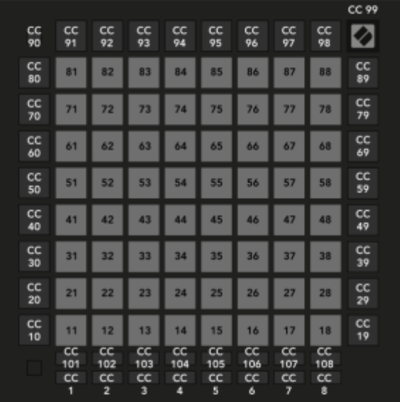

<h1 align="center">
Station 5 Game Pad
</h1>

<p align="center">
<i align="center">Touch-based gamepad using Novation's Launchpad Pro MK3 </i>
</p>


# Overview
For the **Memory Sequence** game portion of Project S.O.N.I.C, we will be using the ***Launchpad Pro MK3*** as our MIDI touchpad. The game pad will be accomodating 2 of our essential gamemodes: easy and hard. The player will be able to play using the central buttons on the Launchpad and switch between easy and hard mode with 2 buttons. 


# Programmer's Section
### Getting started

We will be connecting our ***Launchpad*** to our ***Rasberry Pi 4*** with a ***USB-C to USB-A cable*** through their respective ports. After which we will be coding inside a Rasberry Pi **python file** which we will be running on a virtual environment. We will be using 3 python files, one for easymode, one for hard mode and another for the main code that we will be using the run the two gamemode files simultaneously. 

A few things to note before proceeding:

1. Ensure that your Rasberry Pi is updated. (e.g date and time, etc) 
2. Make sure you are running on a virtual environment (Create one if you have not done so)
3. Make sure that you have downloaded **python-osc** in your virtual environment.
4. Install the following modules inside your virtual environment:


     ```
    pip install mido
    pip install python-rtmidi
     ```
      After you have installed both modules, you can proceed to check the **input and outport ports** of your Launchpad. We will need the **MIDI input port** in order to get our code to run from our Rasberry Pi to our Launchpad.  
       
     
     Connect your Launchpad to your Rasberry Pi first using your USB-C to USB-A cable, then put in the following code on a python file and run it on your virtual environment:
      ```
     import mido

     # List all input MIDI devices
     print("Input MIDI Devices:")
     for input_name in mido.get_input_names():
     print(input_name)

     # List all output MIDI devices
     print("\nOutput MIDI Devices:")
     for output_name in mido.get_output_names():
     print(output_name)
     ```
     
     - You would then be able to see three input ports from your Launchpad. Note down the one with the MIDI input port.
     


### Starting your Launchpad
  Activate your Launchpad's **Custom Mode 8**. This is where our game will be played with the touch LED buttons. 

**Hit the "Custom" button and then press the 8th bottom button on the far right.**
 


We will then need to find the button IDs for each LED button in order to start configuring our buttons as well as other LED lights on the Launchpad. You can choose to refer to the [Launchpad Pro MK3's Programmer's manual](https://fael-downloads-prod.focusrite.com/customer/prod/s3fs-public/downloads/LPP3_prog_ref_guide_200415.pdf), or you can follow the tutorial on [huats-club](https://github.com/huats-club/mts_sensor_cookbook/blob/main/4.%20midi/midi.md)


 

>On the center of your launchpad, there is an 8x8 LED button layout labelled together with their respective button IDs. You would need to use these button IDs inside your code in order to configure your LED displays and buttons.

Once you have note them all down, we can now start configuring our LED lights and our touch buttons for playing the game. 

 ***If you want to reset your LED lights/buttons, switch to another custom mode then come back to custom mode 8. The LED lights of the touch buttons will disappear.***


# Code Section

This is the file that we will be using to operate our whole memory sequence game: 

- The file we will be solely running on is our main file ([main_file.py](https://github.com/uselesskcid/EGL314-Project-S.O.N.I.C-Team-C-POC/blob/main/Launchpad%20Pro/main_file.py)) whch is the master file that sets up the whole game and  controls the running proccesses of each individual game mode.


 >In the file, we have coded it so that the launchpad starts off with a single start buttton.
 Once the start button is pressed, the layout of the starting game mode will appear, and we can switch between easy and hard mode using 2 buttons on the bottom right corner.


The two mode buttons will run the following modes:
 - Green: Easy mode ([finaleasymode.py](https://github.com/uselesskcid/EGL314-Project-S.O.N.I.C-Team-C-POC/blob/main/Launchpad%20Pro/finaleasymode.py))
 
 


 >The easy mode will consist of directions North, South, East and West, with the buttons being inside the white circle.
 - Red: Hard mode ([finalhardmode.py](https://github.com/uselesskcid/EGL314-Project-S.O.N.I.C-Team-C-POC/blob/main/Launchpad%20Pro/finalhardmode.py))

 
 >The hard mode will consist of directions North East, East, South East, South West, West and South West which the buttons for inputting these directions are in the white rectangular box.
